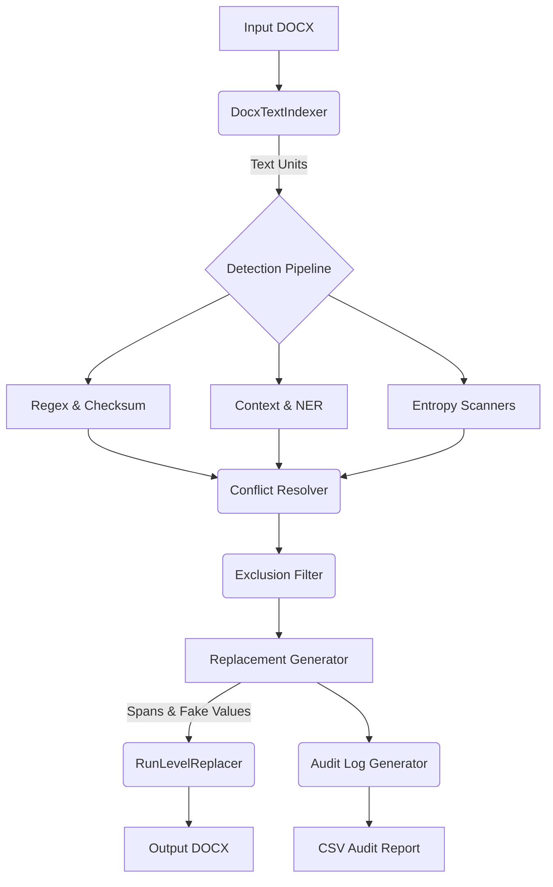

# High Level Design (HLD)

## 1. System Overview
The PII Redaction Tool is designed to ingest a Microsoft Word document (`.docx`), accurately identify various forms of Personally Identifiable Information (PII), and output a fully redacted document where sensitive data is replaced by deterministic, realistic-looking fake values.

## 2. Core Architecture
The system follows a linear pipeline architecture consisting of three main phases: **Parsing/Indexing**, **Detection**, and **Mutation/Reporting**.

## 3. Key Components
1. **DocxTextIndexer**: Parses the `.docx` file into paragraph and table-cell units while preserving the underlying XML Run offsets.
2. **Detection Pipeline**: A tiered engine that aggregates detections from:
   - *Structured Scanners*: Fast regex matching for emails, phones, SSNs, credit cards.
   - *Entropy Scanners*: Shannon entropy checks for API keys and secrets.
   - *Context Scanners*: Pattern-based cues (e.g., "Contact Person:") for names and companies.
3. **Exclusion Filter**: An allow-list engine that filters out public organizations (e.g., SEBI, BSE) to minimize false positives.
4. **Replacement Generator**: Ensures referential integrity by mapping identical original entities to the same fake value via SHA-256 stable indexing.
5. **RunLevelReplacer**: Modifies the underlying XML elements (runs) to inject fake values without destroying document formatting.

## 4. Design Decisions & Trade-offs
- **Regex vs Deep Learning**: Chose regex and context heuristics over heavy NLP models (like spaCy or transformer-based NER) to ensure the tool is fast, lightweight, and dependency-free. Tradeoff: Decreased recall for names that lack contextual cues.
- **In-place XML mutation**: Directly manipulating `python-docx` runs instead of rebuilding paragraphs from scratch preserves tables, bold text, and hyperlinks.
